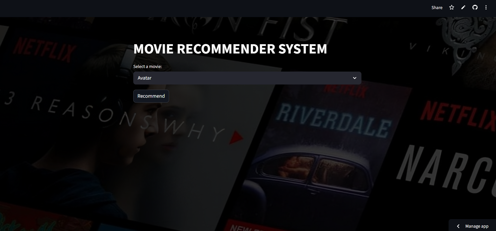
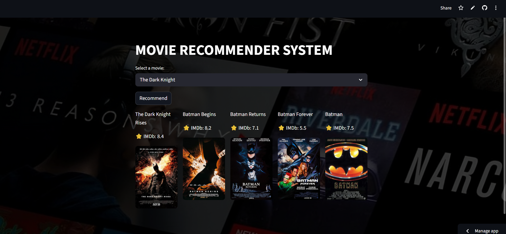
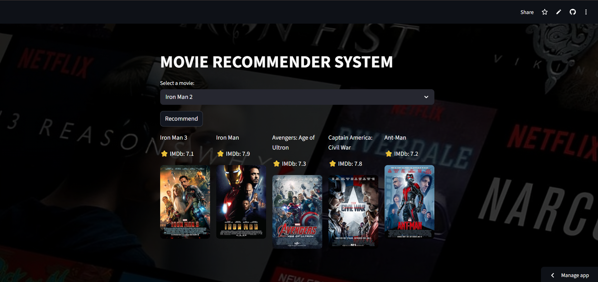

# 🎬 Movie Recommendation System

A Machine Learning-based movie recommendation web application that suggests similar movies using content-based filtering techniques. The system recommends movies based on genres, cast, keywords, and movie descriptions through an interactive Streamlit interface.

## 🚀 Features

* Recommend movies similar to a selected movie
* Content-based recommendation system
* Displays movie posters
* Interactive and user-friendly interface
* Fast recommendation generation

## 📸 Screenshots

### Home Page



### Recommendation Results




## 🛠️ Tech Stack

* Python
* Streamlit
* Pandas
* NumPy
* Scikit-learn
* TMDB API

## 📊 Dataset

TMDB 5000 Movie Dataset

* 5000+ Movies
* Genres, Cast, Crew, Keywords, and Overview data

## ⚙️ Methodology

* Data Cleaning & Preprocessing
* Feature Extraction
* CountVectorizer
* Cosine Similarity

## 📈 Output

* Top 5 similar movie recommendations
* Movie poster display
* Real-time recommendation generation

## ▶️ Run Locally

```bash
pip install -r requirements.txt
streamlit run app.py
```
